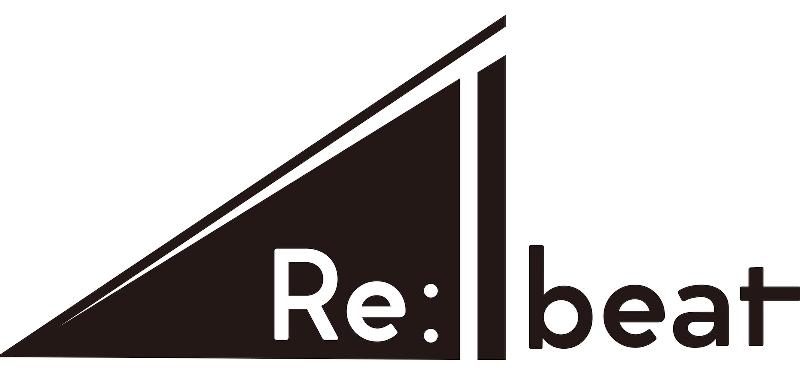

TEDx AoyamaGakuinU 2020 のテーマです。

物・文化・思想...時代の流れや社会情勢などの様々な理由により、価値が薄れている、忘れられているものがある。
テーマは、

<Col>

</Col>

<th>=本来の価値の再発見＋既存・新価値の未来への共有"。そして、Rebeat"に関わる全員が自身の能力・個性を再発見し、"その人らしいアクション"のきっかけ作りを。</th>

---

<h1>TEDxとは？</h1>

TEDxとは「ideas worth spreading(価値あるアイデアを広く共有する)」というTEDの精神を共有するために、TEDから独立して(x=independently organized TED event)その地域や組織の特性に合わせて開催できるトークイベントのことです。
TEDx AoyamaGakuinUは、青山学院大学の学生が主体となって自主的にTEDxの活動を行い、運営しています。

<a href="https://www.ted.com/about/programs-initiatives/tedx-program"><u>TEDx Program</u></a>

<h1>TEDxAoyamaGakuinUとは</h1>

TEDxAoyamaGakuinU（青山学院大学公認団体 ）は青山学院大学を拠点にTEDxを企画・運営する学生団体です。今年度のメンバーは地球社会共生学部の学生を中心にした21名。
TEDの理念”Ideas worth Spreading”のもと「多様性に富んだスピーカー・参加者・スポンサー・スタッフの4者が共創することで”新たなアイデアや繋がりが生まれる”」TEDxを目指しています。

2020年のTEDxAoyamaGakuinUは初のオンライン開催。オンラインだからこそできる演出や表現、コミュニケーションに挑戦しています。観たことがない、全く新しいTEDxをお届けします。
