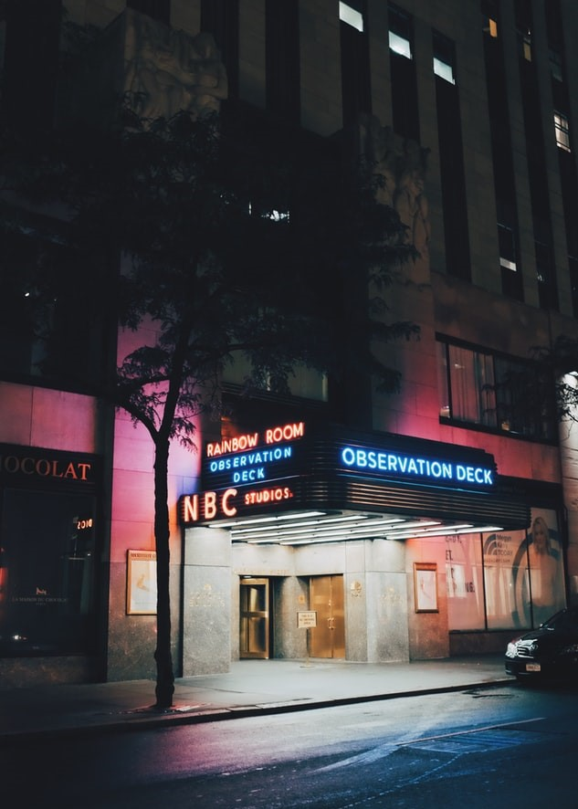

Time Schedule will be the following lineup.

---

## Time Schedule

Introduction 12:00~

Speakers

<th>Misaki Tanaka</th>12:05~12:20 

<th>Kawasaki</th>12:20~12:35 

<th>Sheila Cliffe </th>12:35~12:50 

 Break Time 5min
 
 
<th>Eric Matsunaga</th>13:00~13:15 

<th>Kuniharu Higano</th>13:15~13:30 

<th>iYuta</th>13:30~13:45 

 
Break Time 5min

<th>Tomimasu</th>15:55~16:10

<th>Mori </th>16:10~16:25

<th>Aiko Yajima</th>16:25~16:40

<th>Sennosuke Kataoka</th>16:40~16:55

### Talk Session
17:00~17:55

<th>Close</th> 17:55~18:00

---

<Row>
<Col>

</Col>
</Row>

<Row>
<Col>

</Col>
</Row>